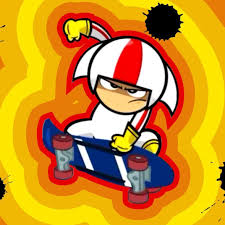

# ESTE REPOSITORIO, ES ÚNICAMENTE PARA REPASO PARA EL PARCIAL.

## **SERIE DE TV**

### KICK BUTTOWSKY ###

Kick Buttowski: Suburban Daredevil (traducido literalmente Kick Buttowski: Temerario de los suburbios; llamado Kick Buttowski en España y Kick Buttowski: medio doble de riesgo en Hispanoamérica) es una serie animada de televisión estadounidense creada y producida por Sandro Corsaro, sobre un joven llamado Clarence Francis "Kick" Buttowski que aspira a convertirse en el mayor temerario del mundo. Se convirtió en la cuarta serie original de Disney XD y la primera serie animada de este tipo. El programa se estrenó el 13 de febrero de 2010, con dos episodios transmitidos el primer día. Se produjeron 52 episodios.2​ El episodio final se emitió el 2 de diciembre de 2012. :metal::vulcan_salute:

()

### *Personajes* ###

* Kick Buttowski
* Wade
* Kendall Perkins
* Brad Buttowski
...

Para más información, visitar: [WIKIPEDIA](https://es.wikipedia.org/wiki/Kick_Buttowski:_Suburban_Daredevil).

